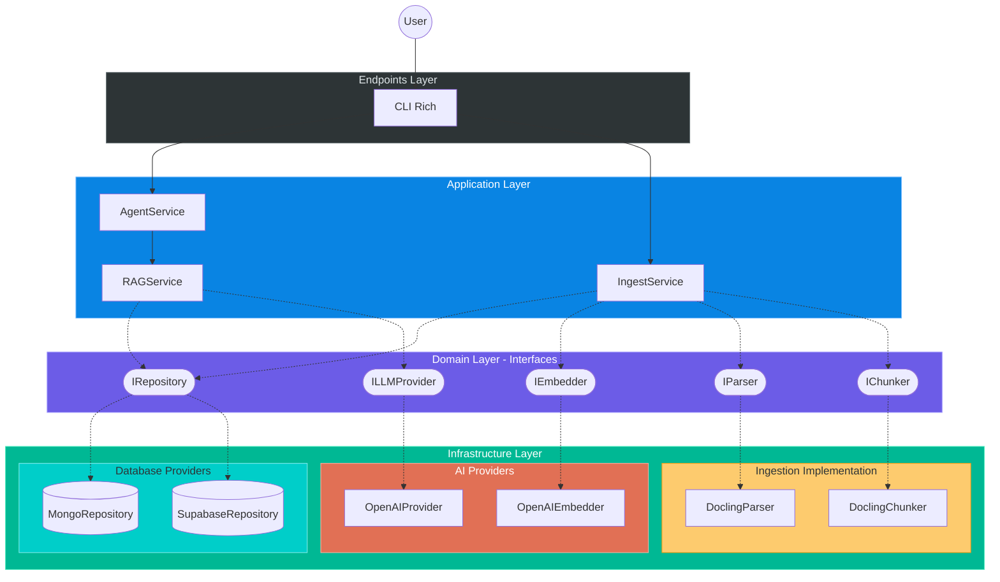

# Hybrid RAG Agent - Clean Architecture

Modern and modular RAG (Retrieval-Augmented Generation) system designed under **Clean Architecture** principles. This system enables intelligent document retrieval with total independence from infrastructure providers (Database, LLM, or Embeddings).

## 🏛️ Architecture: Clean RAG Design

This project implements a decoupled architecture where business logic resides in the core, protected from changes in external services.

### Design Principles

-   **Provider Independence**: Easily switch between MongoDB, Supabase, PostgreSQL, or any other DB by implementing its interface.
-   **AI Abstraction**: Support for multiple LLM and Embeddings providers (OpenAI, Anthropic, Local).
-   **Testability**: RAG logic verifiable without external connections.
-   **CLI-First**: Powerful terminal interface designed for technical workflows.

### Layer Structure

1.  **Domain (Core)**: Pure schemas (`Document`, `Chunk`) and abstract interfaces (`IRepository`, `ILLMProvider`, `IParser`, `IChunker`).
2.  **Application (Services)**: `AgentService` (agentic entry point), `RAGService` (hybrid search), `IngestService` (modular ingestion).
3.  **Infrastructure**: Concrete implementations (currently includes **MongoDB**, **Supabase**, and **OpenAI**).
4.  **Endpoints**: User interface via CLI (Rich).

---

### Architecture Diagram (C4 Clean Design)



---

## 📂 Project Organization

```text
src/
├── core/
│   ├── schemas/        # Base models: Document, Chunk, SearchHit
│   ├── dtos/           # Data Transfer Objects
│   └── interfaces/     # Abstract contracts (IRepository, IParser, etc.)
├── services/           # Business logic (Agent, RAG, Ingestion)
├── infrastructure/     # Concrete provider implementations (Supabase, OpenAI, Docling)
└── endpoints/          # Input adapters (CLI)
```

---

## 🚀 Quick Start Guide

### 1. Installation

Requires Python 3.10+ and [UV Package Manager](https://astral.sh/uv/).

```bash
git clone https://github.com/FullFran/Hybrid-RAG-example.git
cd Hybrid-RAG-example
uv venv && uv sync
```

### 2. Configuration

Copy `.env.example` to `.env` and set your environment variables (Supabase URL/Key, OpenAI API Key, etc.).

### 3. Usage

```bash
# Ingest documents
uv run python -m src.endpoints.cli.ingest -d ./documents

# Start the intelligent chat
uv run python -m src.endpoints.cli.main
```

---

## 🛠️ Extensibility

Thanks to the clean architecture, adding a new database provider is as simple as:

1.  Create a new class in `src/infrastructure/database/`.
2.  Implement the `IRepository` interface.
3.  Inject it into the service during application bootstrap.
