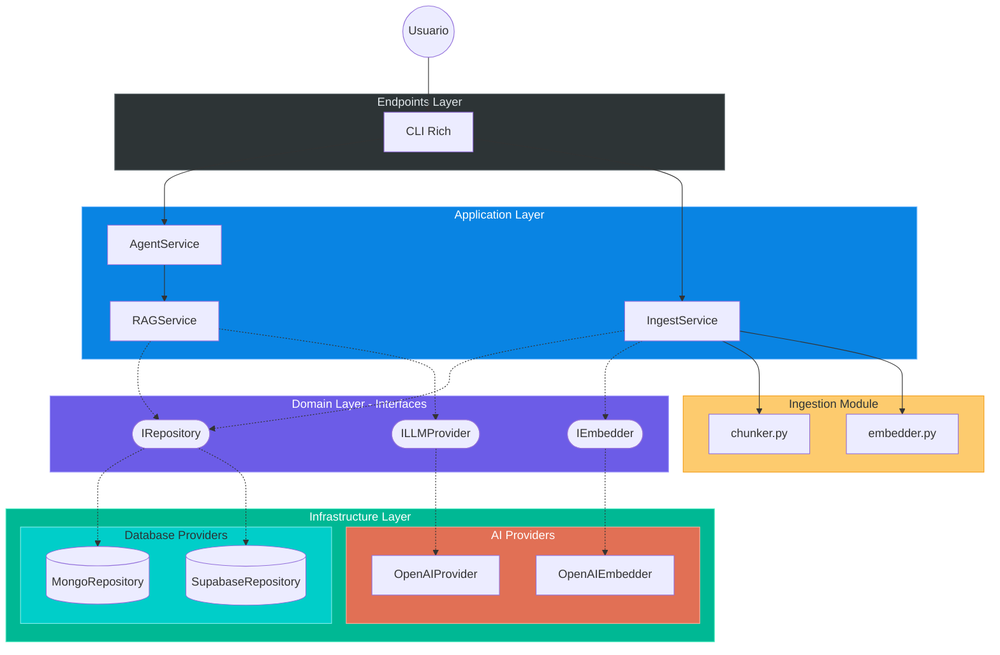

# Hybrid RAG Agent - Clean Architecture

Sistema RAG (Generación Aumentada por Recuperación) moderno y modular diseñado bajo principios de **Clean Architecture**. Este sistema permite la recuperación inteligente de documentos con total independencia de los proveedores de infraestructura (Base de Datos, LLM o Embeddings).

## 🏛️ Arquitectura: Clean RAG Design

Este proyecto implementa una arquitectura desacoplada donde la lógica de negocio reside en el núcleo, protegida de cambios en servicios externos.

### Principios de Diseño

- **Independencia de Proveedores**: Intercambia fácilmente entre MongoDB, Supabase, PostgreSQL o cualquier otra DB implementando su interfaz.
- **Abstracción de IA**: Soporte para múltiples proveedores de LLM y Embeddings (OpenAI, Anthropic, Local).
- **Testabilidad**: Lógica de RAG verificable sin necesidad de conexiones externas.
- **CLI-First**: Interfaz potente por terminal diseñada para flujo de trabajo técnico.

### Estructura de Capas

1.  **Domain (Core)**: Schemas puros (`Document`, `Chunk`) e interfaces abstractas (`IRepository`, `ILLMProvider`).
2.  **Application (Services)**: `AgentService` (punto de entrada agéntico), `RAGService` (búsqueda híbrida), `IngestService` (ingesta).
3.  **Infrastructure**: Implementaciones concretas (actualmente incluye **Supabase** y **OpenAI**).
4.  **Endpoints**: Interfaz de usuario vía CLI (Rich).

---

### Diagrama de Arquitectura (C4 Clean Design)



---

## 📂 Organización del Proyecto

```text
src/
├── core/
│   ├── schemas/        # Modelos base: Document, Chunk, SearchMatch
│   ├── dtos/           # Objetos de transferencia de datos
│   └── interfaces/     # Contratos abstractos (IRepository, ILLMProvider)
├── services/           # Lógica de negocio (Agent, RAG, Ingestión)
├── infrastructure/     # Implementaciones concretas de proveedores (Supabase, OpenAI)
└── endpoints/          # Adaptadores de entrada (CLI)
```

---

## 🚀 Guía de Inicio Rápido

### 1. Instalación

Requiere Python 3.10+ y [UV Package Manager](https://astral.sh/uv/).

```bash
git clone https://github.com/FullFran/Hybrid-RAG-example.git
cd Hybrid-RAG-example
uv venv && uv sync
```

### 2. Configuración

Copia `.env.example` a `.env` y configura tus variables de entorno (Supabase URL/Key, OpenAI API Key, etc.).

### 3. Uso

```bash
# Ingestar documentos
uv run python -m src.endpoints.cli.ingest -d ./documents

# Iniciar el chat inteligente
uv run python -m src.endpoints.cli.main
```

---

## 🛠️ Extensibilidad

Gracias a la arquitectura limpia, añadir un nuevo proveedor de base de datos es tan simple como:

1. Crear una nueva clase en `src/infrastructure/database/`.
2. Implementar la interfaz `IRepository`.
3. Inyectarla en el servicio al iniciar la aplicación.
