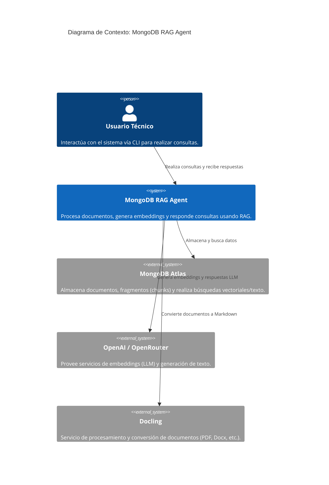
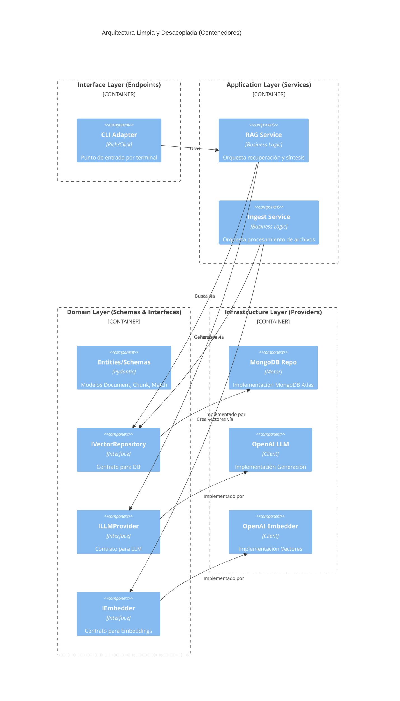

# MongoDB RAG Agent - Búsqueda en Base de Conocimientos Inteligente

Sistema RAG (Generación Aumentada por Recuperación) que combina **MongoDB Atlas Vector Search** con **Pydantic AI** para la recuperación inteligente de documentos, diseñado bajo principios de Arquitectura Limpia.

## 🏛️ Arquitectura Objetivo: Clean RAG Architecture

Este proyecto implementa una arquitectura **limpia (Clean Architecture)** y desacoplada. El objetivo principal es garantizar la intercambiabilidad de proveedores (Base de Datos, LLM, Embeddings) y organizar el código siguiendo principios de responsabilidad única.

### Principios de Diseño

- **Independencia de Frameworks**: La lógica de negocio no depende de bibliotecas externas.
- **Testabilidad**: Las reglas de negocio se pueden probar sin la base de datos o el LLM.
- **Independencia de la UI**: La interfaz (CLI o API) puede cambiar sin afectar al núcleo.
- **Independencia de la Base de Datos**: Es posible cambiar de MongoDB a cualquier otra base de datos (como PostgreSQL con pgvector) implementando la interfaz correspondiente.

### Capas del Sistema e Interfaces

1. **Schemas (Capa de Dominio)**: Define modelos de datos puros (`Document`, `Chunk`, `SearchMatch`).
2. **Interfaces (Contratos)**: Abstracciones que definen el comportamiento esperado de componentes externos:
   - `IVectorRepository`: Búsqueda y persistencia de vectores.
   - `ILLMProvider`: Generación de texto mediante modelos de lenguaje.
   - `IEmbedder`: Conversión de texto a vectores numéricos.
3. **Services (Capa de Aplicación)**: Orquestación de la lógica de negocio (`RAGService`, `IngestionService`).
4. **Infrastructure (Capa Externa)**: Implementaciones concretas de las interfaces (`MongoRepository`, `OpenAIProvider`, `OpenAIEmbedder`).

---

### Diagramas de Arquitectura (C4)

#### Nivel 1: Contexto



#### Nivel 2: Contenedores e Interfaces



---

## 💻 Inversión de Dependencias: Ejemplo

El `RAGService` no conoce los detalles de MongoDB o OpenAI; solo interactúa con contratos:

```python
# Capa de Aplicación (Independiente)
class RAGService:
    def __init__(self, repo: IVectorRepository, llm: ILLMProvider):
        self.repo = repo  # Se inyecta la interfaz (Mongo o Postgres)
        self.llm = llm

    async def answer(self, query: str):
        # 1. Obtener embedding (vía IEmbedder)
        # 2. resultados = await self.repo.search(vector)
        # 3. respuesta = await self.llm.generate(context, query)
```

---

## 📂 Organización del Proyecto

```text
src/
├── core/
│   ├── schemas/        # Modelos base: Document, Chunk, SearchMatch
│   ├── dtos/           # Objetos de transferencia de datos (Input/Output)
│   └── interfaces/     # Contratos abstractos (IVectorRepository, ILLMProvider)
├── services/           # Lógica de negocio (RAG, Ingestión)
├── infrastructure/     # Implementaciones concretas de proveedores
│   ├── database/       # mongo_repo.py, pg_repo.py (opcional)
│   ├── llm/            # openai_provider.py, anthropic_provider.py
│   └── embeddings/     # openai_embedder.py
└── endpoints/          # Adaptadores de entrada (CLI, API)
    ├── cli/            # Interfaz de terminal con Rich
    └── api/            # (Planificado) FastAPI
```

---

## 🚀 Guía de Inicio Rápido

### 1. Instalación

- Requiere Python 3.10+ y [UV Package Manager](https://astral.sh/uv/).

```bash
git clone https://github.com/coleam00/MongoDB-RAG-Agent.git
cd MongoDB-RAG-Agent
uv venv && uv sync
```

### 2. Configuración

Copia `.env.example` a `.env` y añade tus credenciales (MongoDB URI, LLM API Key, etc.).

### 3. Ingestión y Ejecución

```bash
# Ingestar documentos de /documents
uv run python -m src.endpoints.cli.ingest -d ./documents

# Iniciar el chat inteligente
uv run python -m src.endpoints.cli.main
```

---

## 🔍 Búsqueda Híbrida y RRF

El proyecto utiliza **manual Reciprocal Rank Fusion (RRF)** para combinar resultados de búsqueda vectorial y de texto. Esto garantiza una precisión óptima en el **nivel gratuito M0** de MongoDB Atlas, superando las limitaciones de los operadores que están en fase de vista previa.

- **Eficacia**: Combina lo mejor de la semántica y las coincidencias exactas.
- **Concurrent**: Ambas búsquedas se ejecutan simultáneamente para mantener baja latencia.
