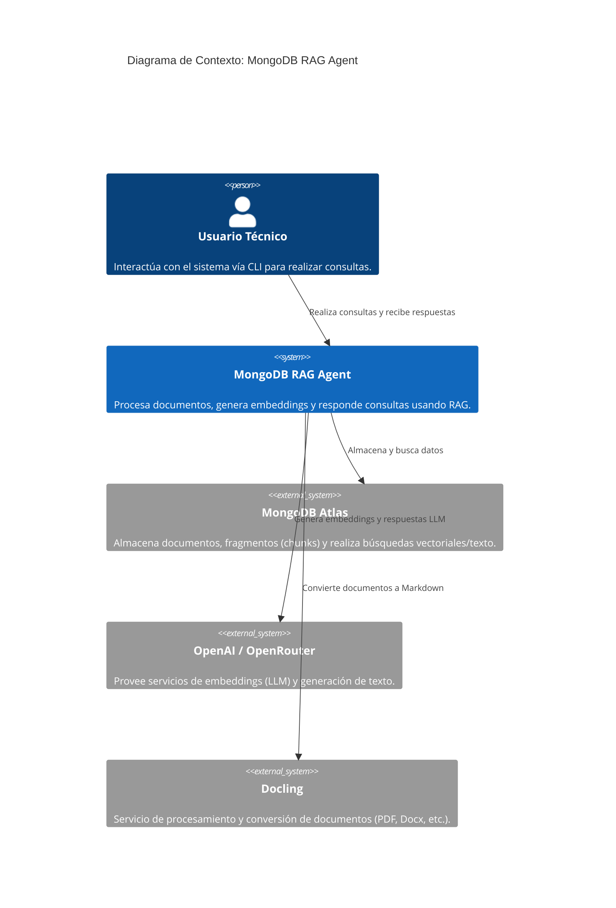
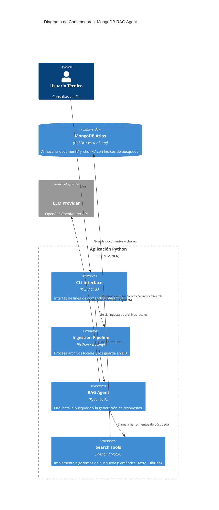

# Arquitectura del Sistema: MongoDB RAG Agent

Este documento describe la arquitectura del sistema **MongoDB RAG Agent**, un sistema de Recuperación Aumentada por Generación (RAG) diseñado para buscar y responder preguntas sobre una base de conocimientos documental.

## 1. Contexto del Sistema (C4 Level 1)

El siguiente diagrama muestra cómo interactúa el sistema con los usuarios y los servicios externos.

---

## 2. Contenedores del Sistema (C4 Level 2)

El sistema se divide en dos componentes principales: el **Pipeline de Ingesta** y el **Agente RAG**.

---

## 3. Flujos Principales

### A. Pipeline de Ingestión

1. **Carga**: Se leen archivos del directorio `./documents`.
2. **Conversión**: **Docling** convierte PDF/Docx/Audio a Markdown.
3. **Fragmentación (Chunking)**: Se divide el texto en fragmentos semánticos.
4. **Embedding**: Se generan vectores para cada fragmento vía OpenAI.
5. **Almacenamiento**: Se guardan en MongoDB en dos colecciones:
   - `documents`: Metadatos del archivo original.
   - `chunks`: Texto del fragmento, vector de embedding y referencia al document_id.

### B. Ciclo de Consulta (RAG)

1. **Input**: El usuario escribe una consulta en el CLI.
2. **Razonamiento**: El Agente (Pydantic AI) decide qué herramienta usar.
3. **Búsqueda Híbrida**:
   - **Búsqueda Semántica**: Usa `$vectorSearch` para encontrar conceptos similares.
   - **Búsqueda de Texto**: Usa `$search` (Lucene) para coincidencias exactas y fuzzy.
4. **Fusión (RRF)**: Se combinan los resultados usando _Reciprocal Rank Fusion_ para priorizar lo más relevante.
5. **Síntesis**: El LLM recibe los fragmentos recuperados y genera la respuesta final.

---

## 4. Dependencias de Base de Datos (Clave para Migración)

Si planeas cambiar la base de datos, los puntos de acoplamiento están en:

1. **`src/dependencies.py`**:

   - Gestión de la conexión (`AsyncMongoClient`).
   - Inicialización del cliente y acceso a colecciones.

2. **`src/tools.py`**:

   - Consultas de agregación de MongoDB.
   - Uso de operadores específicos: `$vectorSearch`, `$search`, `$lookup` (para joins entre chunks y docs), y `$meta: "vectorSearchScore"`.

3. **`src/ingestion/ingest.py`**:
   - Lógica de guardado (`insert_one`, `insert_many`).
   - Gestión de IDs de documentos (`ObjectId`).

> [!IMPORTANT]
> El sistema utiliza **RRF Manual** en Python (`reciprocal_rank_fusion` en `src/tools.py`). Esto es una ventaja para la migración, ya que no dependes de una implementación nativa de la base de datos para la fusión de rangos.

---

## 5. Modelos de Datos

- **Document**: `{ _id, title, source, metadata, created_at }`
- **Chunk**: `{ _id, document_id, content, embedding: [float], metadata, token_count }`
