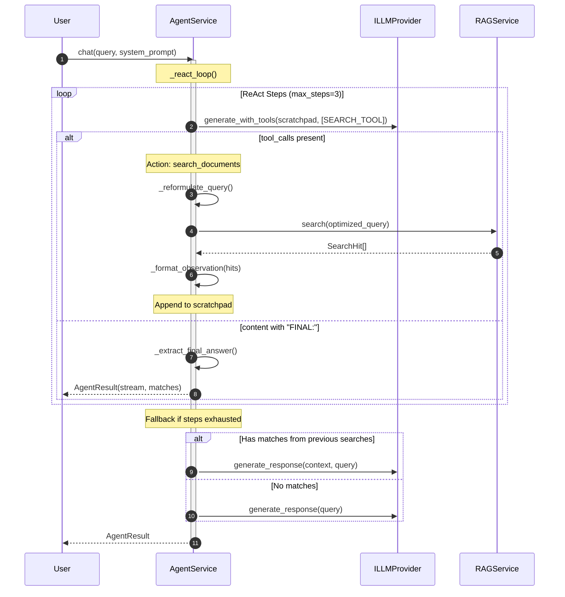
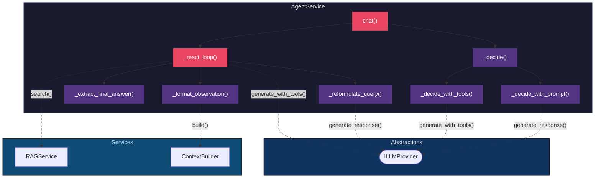

# Agent Service - ReAct Pattern Implementation

The `AgentService` implements a **real ReAct (Reasoning + Acting) loop** that iteratively uses tools before generating a final answer. This is the main entry point of the system.

## 1. Responsibility

The agent orchestrates the decision-making process:

- Decides **when** to search the knowledge base
- Executes **multiple search iterations** if needed
- Builds context from observations
- Generates a final answer when ready

## 2. ReAct Pattern (Iterative Loop)

Unlike a simple router, the ReAct pattern allows **multi-step reasoning**:

```
Step 1: Thought → Action (search) → Observation
Step 2: Thought → Action (search again) → Observation
Step 3: Thought → FINAL: [answer]
```

The agent continues until it has enough information or reaches `max_steps`.

## 3. Sequence Diagram (ReAct Loop)



## 4. Component Diagram



## 5. Key Methods

| Method | Purpose |
|--------|---------|
| `chat()` | Main entry point. Routes to ReAct loop or fallback. |
| `_react_loop()` | Core ReAct implementation with scratchpad. |
| `_format_observation()` | Formats search results for the scratchpad. |
| `_extract_final_answer()` | Extracts answer after `FINAL:` marker. |
| `_reformulate_query()` | Optimizes query for semantic search. |
| `_decide()` | Legacy router for LLMs without tool support. |

## 6. Configuration

| Parameter | Default | Description |
|-----------|---------|-------------|
| `max_steps` | `3` | Maximum ReAct iterations before fallback |
| `conservative` | `True` | Search if in doubt (legacy mode) |
| `limit` | `5` | Max documents to retrieve per search |

## 7. Response Structure

```python
@dataclass
class AgentResult:
    stream: AsyncIterator[str]          # Always a stream
    searched: bool = False              # Whether RAG was used
    search_query: str | None = None     # Last optimized query
    matches: List[SearchHit] = []       # Retrieved documents
```

## 8. Fallback Strategy

If the LLM does not support tools (`supports_tools() == False`), the agent falls back to:

1. Prompt-based classification (SEARCH vs DIRECT)
2. Single-shot RAG or direct response

This maintains compatibility with any LLM provider.
