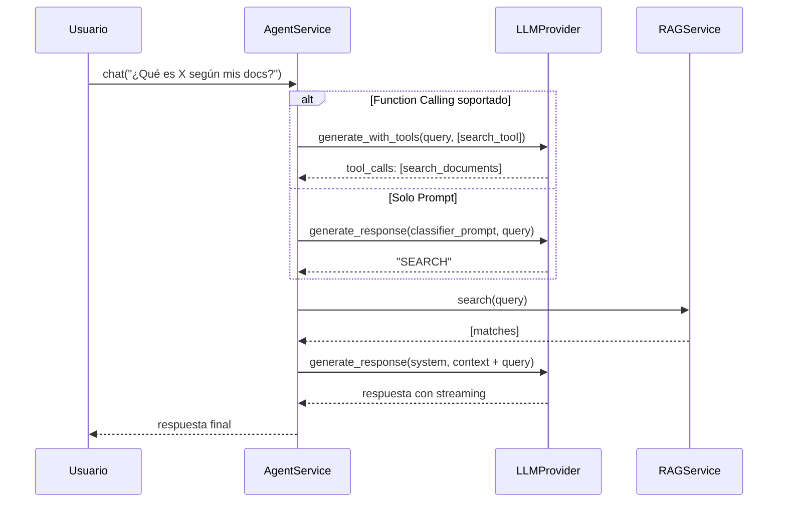

# Agent Service - Arquitectura del Agente ReAct

Este documento explica en detalle cómo funcionará el `AgentService`, un agente ReAct vanilla que decide automáticamente si responder directamente o buscar en el RAG.

## 1. Problema a Resolver

El `RAGService` actual **siempre** busca en la base de conocimientos antes de responder. Esto tiene dos problemas:

1. **Latencia innecesaria**: Preguntas triviales como "¿Cuánto es 2+2?" pasan por todo el pipeline de búsqueda.
2. **Pérdida de contexto**: El LLM solo ve documentos recuperados, no puede usar su conocimiento general.

**Solución**: Un agente que decide cuándo buscar y cuándo responder directamente.

---

## 2. Patrón ReAct (Reason-Act)

El patrón ReAct es un loop simple:

```
REASON → ACT → OBSERVE → (repeat or finish)
```

En nuestro caso simplificado:

```
1. REASON: ¿Necesito buscar información?
2. ACT:
   - Sí → Ejecutar RAGService.search()
   - No → Responder directamente
3. RESPOND: Generar respuesta final
```

---

## 3. Estrategias de Decisión

Existen dos formas de implementar la decisión "¿necesito buscar?":

### A. Function Calling (OpenAI-style)

**Cómo funciona:**

```python
tools = [{
    "type": "function",
    "function": {
        "name": "search_documents",
        "description": "Buscar información en la base de conocimientos",
        "parameters": {
            "type": "object",
            "properties": {
                "query": {"type": "string", "description": "Consulta de búsqueda"}
            }
        }
    }
}]

# El LLM responde con:
# - tool_calls: [...] → Quiere buscar
# - content: "..." → Respuesta directa
```

**Ventajas:**

- Más preciso (el modelo elige explícitamente)
- Puede pasar parámetros estructurados
- Nativo en OpenAI, Azure, Anthropic, Gemini

**Desventajas:**

- No todos los proveedores lo soportan
- Requiere extensión de la interfaz `ILLMProvider`

### B. Prompt Engineering (Universal)

**Cómo funciona:**

```python
system = """Clasifica si necesitas buscar información.
Responde SOLO: SEARCH o DIRECT

SEARCH = Información específica de documentos
DIRECT = Conocimiento general, matemáticas, conversación"""

response = await llm.generate_response(system, query)
needs_search = "SEARCH" in response.upper()
```

**Ventajas:**

- Funciona con cualquier LLM
- No requiere modificar interfaces

**Desventajas:**

- Menos preciso (depende del prompt)
- Una llamada extra al LLM

---

## 4. Arquitectura Propuesta

### Dónde vive cada responsabilidad

```
┌─────────────────────────────────────────────────────────────────┐
│                        AgentService                              │
│  (Orquesta la decisión y delega al RAG o responde directo)      │
└─────────────────────────────────────────────────────────────────┘
           │                                    │
           ▼                                    ▼
┌─────────────────────┐            ┌─────────────────────────────┐
│     RAGService      │            │      ILLMProvider           │
│ (Busca + Responde)  │            │ (Respuesta directa)         │
└─────────────────────┘            └─────────────────────────────┘
```

### ¿Se modifica ILLMProvider?

**Opción A: Extender la interfaz** (Recomendado para function calling)

```python
# src/core/interfaces/llm.py
class ILLMProvider(ABC):
    @abstractmethod
    async def generate_response(...) -> AsyncIterator[str] | str:
        """Generación estándar."""
        pass

    @abstractmethod
    async def generate_with_tools(
        self,
        system_prompt: str,
        user_prompt: str,
        tools: list[dict]
    ) -> ToolResponse:
        """Generación con function calling. Retorna tool_calls o content."""
        pass

    def supports_tools(self) -> bool:
        """Indica si el proveedor soporta function calling."""
        return False  # Default: no soporta
```

**Opción B: Mantener interfaz simple** (Para máxima compatibilidad)

- La lógica de decisión vive 100% en `AgentService`
- Usa prompt engineering para decidir
- No requiere cambios en `ILLMProvider`

---

## 5. Flujo Detallado



---

## 6. Implementación Sugerida

### Estructura de archivos

```
src/
├── core/
│   └── interfaces/
│       └── llm.py              # Añadir supports_tools() opcional
├── services/
│   ├── agent_service.py        # NUEVO - Orquesta decisiones
│   └── rag_service.py          # Sin cambios
└── infrastructure/
    └── llm/
        └── openai_provider.py  # Implementar generate_with_tools()
```

### Código del AgentService

```python
class AgentService:
    """Agente ReAct que decide cuándo usar RAG."""

    def __init__(
        self,
        rag_service: RAGService,
        llm: ILLMProvider,
        conservative: bool = True  # Si hay duda, buscar
    ):
        self.rag = rag_service
        self.llm = llm
        self.conservative = conservative

        # Tool definition para function calling
        self.search_tool = {
            "type": "function",
            "function": {
                "name": "search_documents",
                "description": "Buscar información en la base de conocimientos del usuario",
                "parameters": {
                    "type": "object",
                    "properties": {
                        "query": {
                            "type": "string",
                            "description": "Consulta optimizada para búsqueda"
                        }
                    },
                    "required": ["query"]
                }
            }
        }

    async def chat(
        self,
        query: str,
        system_prompt: str
    ) -> AsyncIterator[str]:
        """Punto de entrada principal del agente."""

        # 1. Decidir si buscar
        should_search, search_query = await self._decide(query)

        if should_search:
            # 2a. Buscar y responder con contexto
            return await self.rag.answer(search_query or query, system_prompt)
        else:
            # 2b. Responder directamente
            return await self.llm.generate_response(
                system_prompt, query, stream=True
            )

    async def _decide(self, query: str) -> tuple[bool, str | None]:
        """Decide si necesita buscar. Retorna (should_search, optimized_query)."""

        # Intentar function calling si está soportado
        if hasattr(self.llm, 'supports_tools') and self.llm.supports_tools():
            return await self._decide_with_tools(query)
        else:
            return await self._decide_with_prompt(query)

    async def _decide_with_tools(self, query: str) -> tuple[bool, str | None]:
        """Usa function calling nativo."""
        response = await self.llm.generate_with_tools(
            system_prompt="Eres un asistente. Si necesitas información de documentos, usa search_documents.",
            user_prompt=query,
            tools=[self.search_tool]
        )

        if response.tool_calls:
            # El modelo quiere buscar
            search_query = response.tool_calls[0].arguments.get("query", query)
            return True, search_query
        else:
            # El modelo respondería directamente
            return False, None

    async def _decide_with_prompt(self, query: str) -> tuple[bool, str | None]:
        """Fallback con prompt engineering."""
        classifier_prompt = """Analiza la pregunta y clasifica:

SEARCH = Requiere información específica de documentos personales
DIRECT = Conocimiento general, matemáticas, definiciones, conversación

Responde SOLO una palabra: SEARCH o DIRECT"""

        response = await self.llm.generate_response(
            classifier_prompt, query, stream=False
        )

        should_search = "SEARCH" in response.upper()

        # En modo conservador, buscar si hay duda
        if self.conservative and "SEARCH" not in response.upper() and "DIRECT" not in response.upper():
            should_search = True

        return should_search, None
```

---

## 7. Comparación de Enfoques

| Aspecto                | Function Calling          | Prompt Engineering                  |
| ---------------------- | ------------------------- | ----------------------------------- |
| **Precisión**          | Alta                      | Media                               |
| **Latencia**           | 1 llamada                 | 2 llamadas (clasificar + responder) |
| **Compatibilidad**     | OpenAI, Anthropic, Gemini | Cualquier LLM                       |
| **Complejidad**        | Mayor (nueva interfaz)    | Menor                               |
| **Query Optimization** | El modelo lo hace         | Necesita paso extra                 |

---

## 8. Decisión de Diseño

> [!IMPORTANT] > **Recomendación**: Implementar **ambas estrategias** con detección automática.
>
> - Si `llm.supports_tools() == True` → Function calling
> - Si no → Prompt engineering como fallback
>
> Esto mantiene la arquitectura flexible y compatible con cualquier proveedor.
