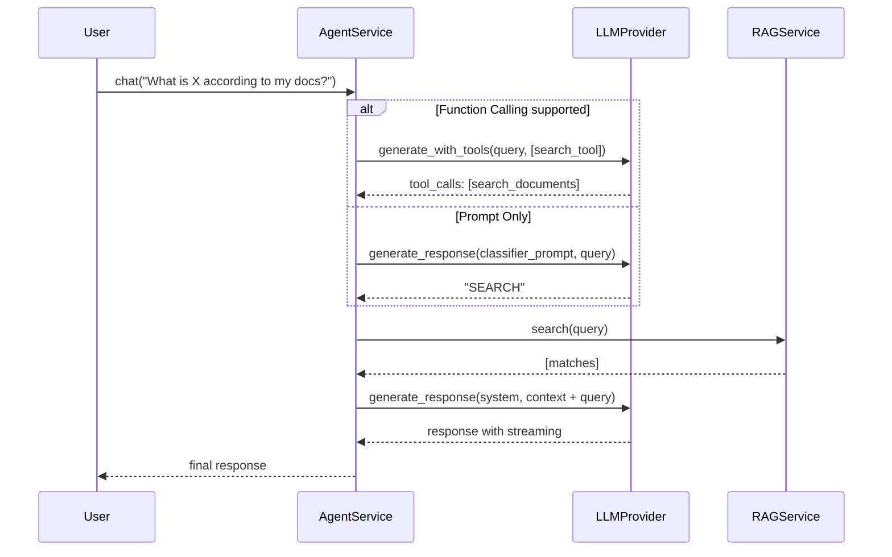

# Agent Service - ReAct Agent Architecture

This document explains in detail how the `AgentService` works, a vanilla ReAct agent that automatically decides whether to respond directly or search the RAG.

## 1. Problem to Solve

The current `RAGService` **always** searches the knowledge base before responding. This has two problems:

1. **Unnecessary Latency**: Trivial questions like "What is 2+2?" go through the entire search pipeline.
2. **Loss of Context**: The LLM only sees retrieved documents and cannot use its general knowledge.

**Solution**: An agent that decides when to search and when to respond directly.

---

## 2. ReAct Pattern (Reason-Act)

The ReAct pattern is a simple loop:

```
REASON → ACT → OBSERVE → (repeat or finish)
```

In our simplified case:

```
1. REASON: Do I need to search for information?
2. ACT:
   - Yes → Execute RAGService.search()
   - No → Respond directly
3. RESPOND: Generate final response
```

---

## 3. Decision Strategies

There are two ways to implement the "do I need to search?" decision:

### A. Function Calling (OpenAI-style)

**How it works:**

```python
tools = [{
    "type": "function",
    "function": {
        "name": "search_documents",
        "description": "Search for information in the knowledge base",
        "parameters": {
            "type": "object",
            "properties": {
                "query": {"type": "string", "description": "Search query"}
            }
        }
    }
}]

# The LLM responds with:
# - tool_calls: [...] → Wants to search
# - content: "..." → Direct response
```

**Pros:**

- More accurate (the model explicitly chooses)
- Can pass structured parameters
- Native in OpenAI, Azure, Anthropic, Gemini

**Cons:**

- Not all providers support it
- Requires extension of the `ILLMProvider` interface

### B. Prompt Engineering (Universal)

**How it works:**

```python
system = """Classify if you need to search for information.
Respond ONLY: SEARCH or DIRECT

SEARCH = Specific information from documents
DIRECT = General knowledge, math, conversation"""

response = await llm.generate_response(system, query)
needs_search = "SEARCH" in response.upper()
```

**Pros:**

- Works with any LLM
- Does not require modifying interfaces

**Cons:**

- Less accurate (depends on the prompt)
- One extra call to the LLM

---

## 4. Proposed Architecture

### Where each responsibility lives

```
┌─────────────────────────────────────────────────────────────────┐
│                        AgentService                              │
│  (Orchestrates the decision and delegates to RAG or responds)    │
└─────────────────────────────────────────────────────────────────┘
           │                                    │
           ▼                                    ▼
┌─────────────────────┐            ┌─────────────────────────────┐
│     RAGService      │            │      ILLMProvider           │
│ (Search + Respond)  │            │ (Direct response)           │
└─────────────────────┘            └─────────────────────────────┘
```

### Is ILLMProvider modified?

**Option A: Extend the interface** (Recommended for function calling)

```python
# src/core/interfaces/llm.py
class ILLMProvider(ABC):
    @abstractmethod
    async def generate_response(...) -> AsyncIterator[str] | str:
        """Standard generation."""
        pass

    @abstractmethod
    async def generate_with_tools(
        self,
        system_prompt: str,
        user_prompt: str,
        tools: list[dict]
    ) -> ToolResponse:
        """Generation with function calling. Returns tool_calls or content."""
        pass

    def supports_tools(self) -> bool:
        """Indicates if the provider supports function calling."""
        return False  # Default: not supported
```

**Option B: Keep interface simple** (For maximum compatibility)

- Decision logic lives 100% in `AgentService`
- Uses prompt engineering to decide
- No changes required in `ILLMProvider`

---

## 5. Detailed Flow



---

## 6. Suggested Implementation

### File Structure

```
src/
├── core/
│   └── interfaces/
│       └── llm.py              # Add optional supports_tools()
├── services/
│   ├── agent_service.py        # NEW - Orchestrates decisions
│   └── rag_service.py          # No changes
└── infrastructure/
    └── llm/
        └── openai_provider.py  # Implement generate_with_tools()
```

### AgentService Code

```python
class AgentService:
    """ReAct Agent that decides when to use RAG."""

    def __init__(
        self,
        rag_service: RAGService,
        llm: ILLMProvider,
        conservative: bool = True  # Search if in doubt
    ):
        self.rag = rag_service
        self.llm = llm
        self.conservative = conservative

        # Tool definition for function calling
        self.search_tool = {
            "type": "function",
            "function": {
                "name": "search_documents",
                "description": "Search for information in the user's knowledge base",
                "parameters": {
                    "type": "object",
                    "properties": {
                        "query": {
                            "type": "string",
                            "description": "Optimized query for search"
                        }
                    },
                    "required": ["query"]
                }
            }
        }

    async def chat(
        self,
        query: str,
        system_prompt: str
    ) -> AsyncIterator[str]:
        """Main agent entry point."""

        # 1. Decide whether to search
        should_search, search_query = await self._decide(query)

        if should_search:
            # 2a. Search and respond with context
            return await self.rag.answer(search_query or query, system_prompt)
        else:
            # 2b. Respond directly
            return await self.llm.generate_response(
                system_prompt, query, stream=True
            )

    async def _decide(self, query: str) -> tuple[bool, str | None]:
        """Decide if search is needed. Returns (should_search, optimized_query)."""

        # Try function calling if supported
        if hasattr(self.llm, 'supports_tools') and self.llm.supports_tools():
            return await self._decide_with_tools(query)
        else:
            return await self._decide_with_prompt(query)

    async def _decide_with_tools(self, query: str) -> tuple[bool, str | None]:
        """Uses native function calling."""
        response = await self.llm.generate_with_tools(
            system_prompt="You are an assistant. If you need information from documents, use search_documents.",
            user_prompt=query,
            tools=[self.search_tool]
        )

        if response.tool_calls:
            # Model wants to search
            search_query = response.tool_calls[0].arguments.get("query", query)
            return True, search_query
        else:
            # Model would respond directly
            return False, None

    async def _decide_with_prompt(self, query: str) -> tuple[bool, str | None]:
        """Fallback with prompt engineering."""
        classifier_prompt = """Analyze the question and classify:

SEARCH = Requires specific information from personal documents
DIRECT = General knowledge, math, definitions, conversation

Respond with ONLY one word: SEARCH or DIRECT"""

        response = await self.llm.generate_response(
            classifier_prompt, query, stream=False
        )

        should_search = "SEARCH" in response.upper()

        # In conservative mode, search if in doubt
        if self.conservative and "SEARCH" not in response.upper() and "DIRECT" not in response.upper():
            should_search = True

        return should_search, None
```

---

## 7. Comparison of Approaches

| Aspect                | Function Calling          | Prompt Engineering                  |
| ---------------------- | ------------------------- | ----------------------------------- |
| **Accuracy**           | High                      | Medium                              |
| **Latency**            | 1 call                    | 2 calls (classify + respond)        |
| **Compatibility**      | OpenAI, Anthropic, Gemini | Any LLM                             |
| **Complexity**         | Higher (new interface)    | Lower                               |
| **Query Optimization** | Handled by the model      | Needs extra step                    |

---

## 8. Design Decision

> [!IMPORTANT]
> **Recommendation**: Implement **both strategies** with automatic detection.
>
> - If `llm.supports_tools() == True` → Function calling
> - If not → Prompt engineering as fallback
>
> This keeps the architecture flexible and compatible with any provider.
