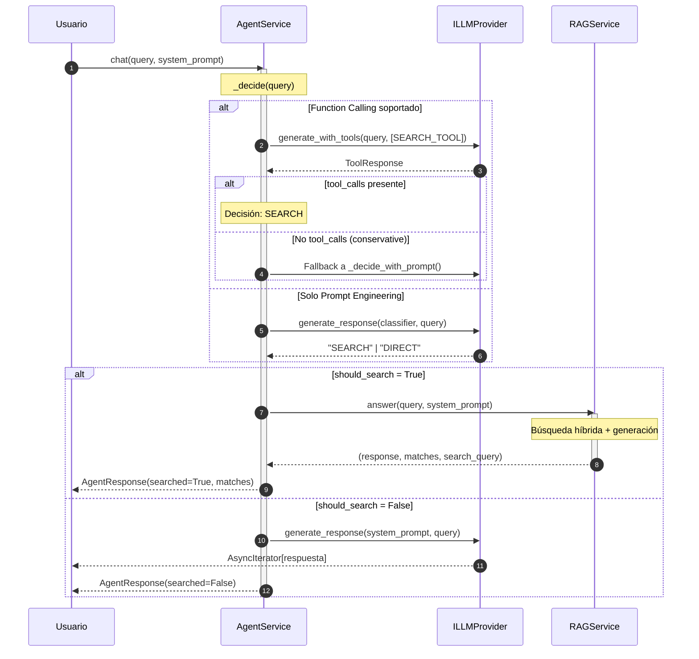

# Detalle de Implementación: Agent Service

Este documento proporciona una vista de "lupa" sobre el `AgentService`, detallando su lógica de decisión ReAct, flujo de datos y cómo orquesta el RAG.

## 1. Responsabilidad

El `AgentService` es un agente ReAct vanilla que actúa como **punto de entrada principal** del sistema. Su función es decidir automáticamente si una pregunta requiere buscar en la base de conocimientos (RAG) o puede responderse directamente con conocimiento general del LLM.

> [!IMPORTANT]
> El agente opera en **modo conservador**: ante cualquier duda, siempre busca en el RAG para priorizar la precisión sobre la velocidad.

## 2. Diagrama de Secuencia (Flujo de Decisión)

El siguiente diagrama muestra el flujo temporal del patrón ReAct:



## 3. Diagrama de Componentes (C4 Zoom-in)

Vista estática de las dependencias internas del `AgentService`:


## 4. Estrategias de Decisión

El agente implementa **dos estrategias** con fallback automático:

### A. Function Calling (Preferida)

Usa la API nativa de OpenAI para definir una herramienta `search_documents`:

```python
SEARCH_TOOL = {
    "type": "function",
    "function": {
        "name": "search_documents",
        "description": "Buscar información en la base de conocimientos",
        "parameters": {"type": "object", "properties": {"query": {...}}}
    }
}
```

- Si el LLM invoca la herramienta → **SEARCH**
- Si el LLM responde directamente → En modo conservador, **fallback a prompt**

### B. Prompt Engineering (Fallback)

Para LLMs que no soportan function calling:

```
Clasifica esta pregunta en UNA palabra:
SEARCH = documentos, reuniones, proyectos, datos personales...
DIRECT = SOLO para: saludos, matemáticas, traducciones...
EN CASO DE DUDA → SEARCH
```

## 5. Respuesta Estructurada

El agente retorna un `AgentResponse` dataclass para **explicabilidad**:

| Campo          | Tipo                 | Descripción                         |
| -------------- | -------------------- | ----------------------------------- |
| `response`     | `AsyncIterator[str]` | Stream de la respuesta              |
| `searched`     | `bool`               | Si usó RAG                          |
| `search_query` | `str \| None`        | Query reformulada usada en búsqueda |
| `matches`      | `List[SearchMatch]`  | Documentos encontrados (fuentes)    |

## 6. Inversión de Dependencias

El `AgentService` depende de abstracciones, no de implementaciones:

| Dependencia   | Interfaz       | Uso                           |
| ------------- | -------------- | ----------------------------- |
| `rag_service` | `RAGService`   | Búsqueda híbrida y generación |
| `llm`         | `ILLMProvider` | Decisión y generación directa |

## 7. Configuración

| Parámetro      | Default | Descripción                             |
| -------------- | ------- | --------------------------------------- |
| `conservative` | `True`  | Si hay duda, buscar en RAG              |
| `limit`        | `5`     | Número máximo de documentos a recuperar |

---

> [!TIP]
> Para cambiar el comportamiento de decisión, edita `CLASSIFIER_PROMPT` en `agent_service.py` o ajusta el prompt del `_decide_with_tools()`.
