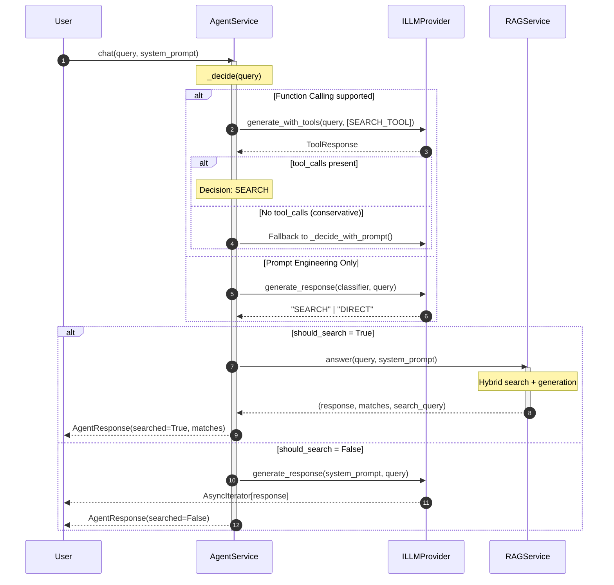
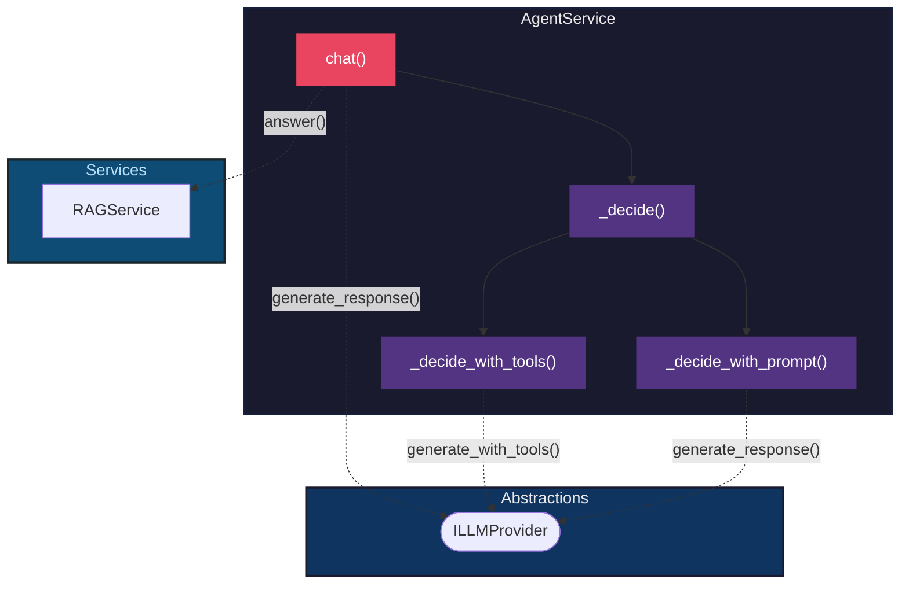

# Implementation Detail: Agent Service

This document provides a "magnifying glass" view of the `AgentService`, detailing its ReAct decision logic, data flow, and how it orchestrates RAG.

## 1. Responsibility

The `AgentService` is a vanilla ReAct agent that acts as the **main entry point** of the system. Its function is to automatically decide if a question requires searching the knowledge base (RAG) or can be answered directly using the LLM's general knowledge.

> [!IMPORTANT]
> The agent operates in **conservative mode**: when in doubt, it always searches the RAG to prioritize accuracy over speed.

## 2. Sequence Diagram (Decision Flow)

The following diagram shows the temporal flow of the ReAct pattern:



## 3. Component Diagram (C4 Zoom-in)

Static view of `AgentService` internal dependencies:



## 4. Decision Strategies

The agent implements **two strategies** with automatic fallback:

### A. Function Calling (Preferred)

Uses the native OpenAI API to define a `search_documents` tool:

```python
SEARCH_TOOL = {
    "type": "function",
    "function": {
        "name": "search_documents",
        "description": "Search for information in the knowledge base",
        "parameters": {"type": "object", "properties": {"query": {...}}}
    }
}
```

- If the LLM invokes the tool → **SEARCH**
- If the LLM responds directly → In conservative mode, **fallback to prompt**

### B. Prompt Engineering (Fallback)

For LLMs that do not support function calling:

```
Classify this question in ONE word:
SEARCH = documents, meetings, personal data...
DIRECT = ONLY for: greetings, math, translations...
IF IN DOUBT → SEARCH
```

## 5. Structured Response

The agent returns an `AgentResponse` dataclass for **explainability**:

| Field          | Type                 | Description                         |
| -------------- | -------------------- | ----------------------------------- |
| `response`     | `AsyncIterator[str]` | Response stream                     |
| `searched`     | `bool`               | Whether RAG was used                |
| `search_query` | `str \| None`        | Reformulated query used for search  |
| `matches`      | `List[SearchMatch]`  | Found documents (sources)           |

## 6. Dependency Inversion

`AgentService` depends on abstractions, not implementations:

| Dependency    | Interface      | Use                           |
| ------------- | -------------- | ----------------------------- |
| `rag_service` | `RAGService`   | Hybrid search and generation  |
| `llm`         | `ILLMProvider` | Decision and direct generation|

## 7. Configuration

| Parameter      | Default | Description                             |
| -------------- | ------- | --------------------------------------- |
| `conservative` | `True`  | Search RAG if in doubt                  |
| `limit`        | `5`     | Maximum number of documents to retrieve |

---

> [!TIP]
> To change decision behavior, edit `CLASSIFIER_PROMPT` in `agent_service.py` or adjust the `_decide_with_tools()` prompt.
