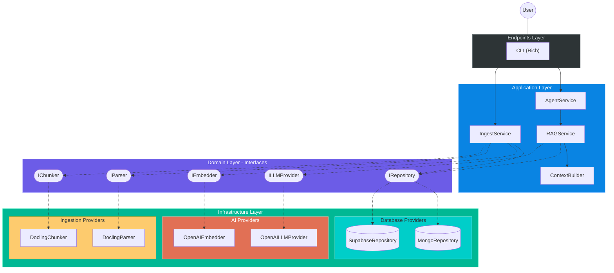
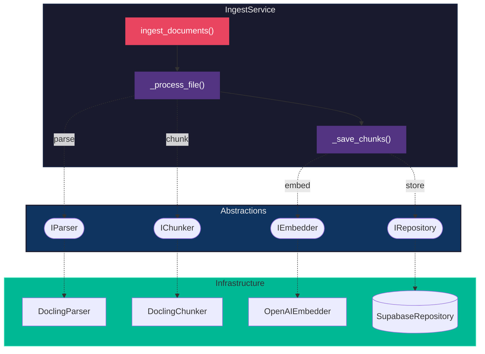
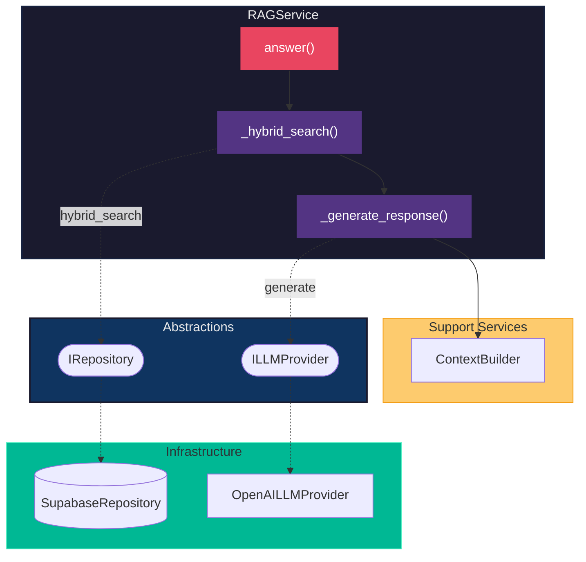
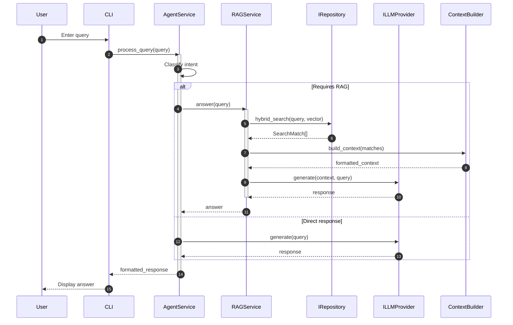
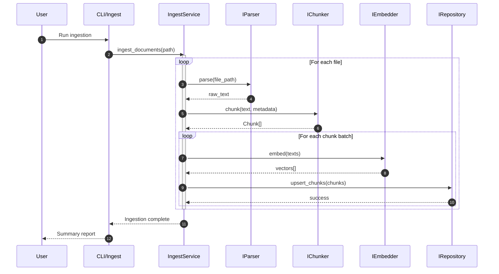

# Target Architecture: Clean RAG Architecture

This document defines the **Clean Architecture** and decoupled design for the RAG system. The goal is to allow interchangeability of providers (Database, LLM, Embeddings, Parsing) and organize code following principles of single responsibility and separation of concerns.

## 1. Design Principles

- **Independence of Frameworks**: Business logic should not depend on external libraries.
- **Testability**: Business rules can be tested without the database or LLM.
- **Independence of UI**: The interface (CLI or API) can change without affecting the core.
- **Independence of Database**: You can switch from MongoDB to Supabase without touching the RAG logic.
- **Independence of Ingestion**: Parsing and chunking strategies can be swapped via interfaces.

## 2. Layer Structure and Interfaces

The architecture is organized into the following contexts:

### A. Schemas (Domain Layer)

Defines base data models used throughout the system. They are pure and unaware of the database.

- `Document`: The original source document.
- `Chunk`: A document fragment with its content and metadata.
- `SearchMatch`: Represents a retrieved fragment with its relevance score.

### B. DTOs (Data Transfer Objects)

Objects for moving data between layers, especially outwards from _Services_.

- `QueryRequest`: User query data.
- `QueryResponse`: Formatted response with sources and metadata.
- `IngestRequest`: File upload/processing data.

### C. Services (Application Layer)

Contains business logic orchestration. Uses interfaces (Abstractions) to interact with external components.

- `AgentService`: **Main entry point**. ReAct agent that decides whether to search RAG or respond directly. See [implementation detail](agent_service_detail.md).
- `RAGService`: Orchestrates hybrid search and generation with context. Uses `ContextBuilder` for context assembly. See [implementation detail](rag_service_detail.md).
- `IngestService`: Orchestrates parsing, chunking, embedding, and storage via interfaces.
- `ContextBuilder`: Assembles context from search results with source attribution.

### D. Core Interfaces (Abstraction Layer)

Abstract contracts that define capabilities without implementation details:

| Interface        | Purpose                                      | Implementations                      |
|------------------|----------------------------------------------|--------------------------------------|
| `IRepository`    | Vector storage and hybrid search             | `MongoRepository`, `SupabaseRepository` |
| `ILLMProvider`   | Text generation                              | `OpenAILLMProvider`                  |
| `IEmbedder`      | Vector embedding generation                  | `OpenAIEmbedder`                     |
| `IParser`        | Document parsing (PDF, DOCX, etc. → text)    | `DoclingParser`                      |
| `IChunker`       | Text segmentation into semantic chunks       | `DoclingChunker`                     |
| `IAdminRepository` | Administrative operations (clean, stats)   | `MongoRepository`, `SupabaseRepository` |

### E. Endpoints (Interface Adapter Layer)

System entry points.

- `CLI`: Current implementation using Rich.
- `API`: (Future) FastAPI/Flask endpoints.

### F. Infrastructure (External Layer)

Concrete implementations of provider interfaces.

- **Database**: `MongoRepository`, `SupabaseRepository`
- **LLM**: `OpenAILLMProvider`
- **Embedder**: `OpenAIEmbedder`
- **Ingestion**: `DoclingParser`, `DoclingChunker`

---

## 3. Architecture Diagrams

### C4 Level 2: Container Diagram

Shows the main containers (applications/services) and how they interact.



### C4 Level 3: Component Diagram - IngestService

Detailed view of the Ingestion Service and its dependencies.



### C4 Level 3: Component Diagram - RAGService

Detailed view of the RAG Service query flow.



---

## 4. Dependency Inversion (Code Example)

To achieve decoupling, services do not import concrete implementations. Instead, they use interfaces:

```python
# core/interfaces/repository.py
class IRepository(ABC):
    @abstractmethod
    async def hybrid_search(self, query: str, vector: list[float], limit: int) -> list[SearchMatch]:
        pass

# core/interfaces/parser.py
class IParser(ABC):
    @abstractmethod
    def parse(self, file_path: Path) -> str:
        """Parse a document file and return its text content."""
        pass

# core/interfaces/chunker.py
class IChunker(ABC):
    @abstractmethod
    def chunk(self, text: str, metadata: dict) -> list[Chunk]:
        """Split text into semantic chunks."""
        pass

# services/ingest_service.py
class IngestService:
    def __init__(
        self,
        repository: IRepository,
        embedder: IEmbedder,
        parser: IParser,    # Interface, not DoclingParser
        chunker: IChunker,  # Interface, not DoclingChunker
    ):
        self.repository = repository
        self.embedder = embedder
        self.parser = parser
        self.chunker = chunker
```

## 5. Folder Organization

```text
src/
├── core/
│   ├── schemas/           # Document, Chunk, SearchMatch
│   ├── dtos/              # Input/Output Data Transfer Objects
│   ├── interfaces/        # Abstract contracts
│   │   ├── repository.py      # IRepository
│   │   ├── admin_repository.py # IAdminRepository
│   │   ├── llm.py             # ILLMProvider
│   │   ├── embedder.py        # IEmbedder
│   │   ├── parser.py          # IParser (NEW)
│   │   └── chunker.py         # IChunker (NEW)
│   └── prompts.py         # System prompts
├── services/              # Business logic orchestration
│   ├── agent_service.py       # ReAct Agent
│   ├── rag_service.py         # Hybrid Search + Generation
│   ├── ingest_service.py      # Document Processing
│   └── context_builder.py     # Context Assembly
├── infrastructure/        # Provider implementations
│   ├── database/
│   │   ├── mongo_repository.py
│   │   └── supabase_repository.py
│   ├── llm/
│   │   └── openai_provider.py
│   ├── embeddings/
│   │   └── openai_embedder.py
│   └── ingestion/         # NEW: Parsing implementations
│       ├── docling_parser.py
│       └── docling_chunker.py
├── endpoints/             # User interfaces
│   ├── cli/
│   │   ├── main.py
│   │   └── ingest.py
│   └── api/               # (Future) FastAPI
└── bootstrap.py           # Dependency injection setup
```

## 6. Sequence Diagram: Query Flow



## 7. Sequence Diagram: Ingestion Flow


