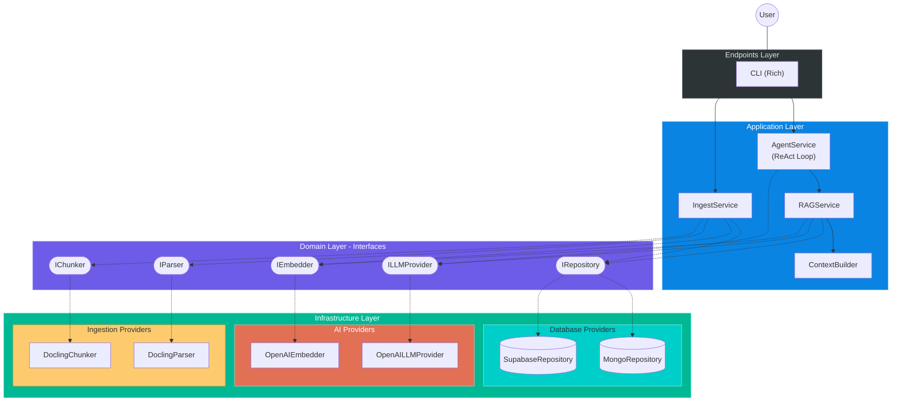
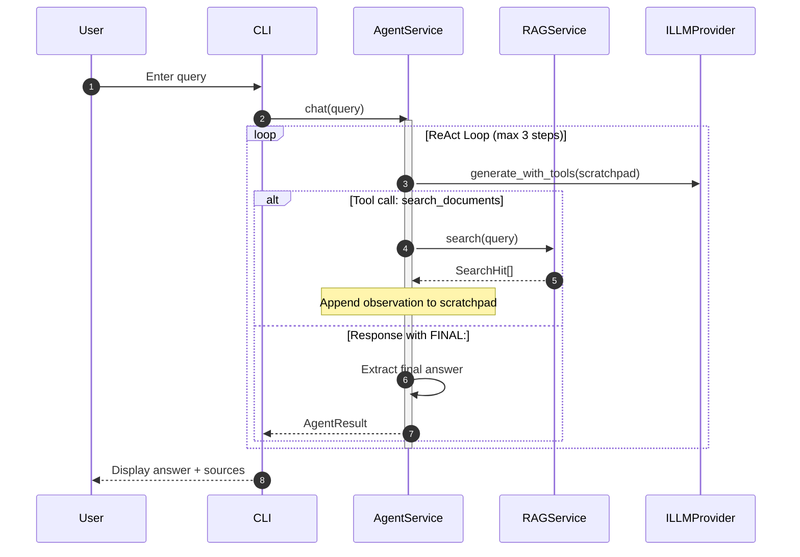
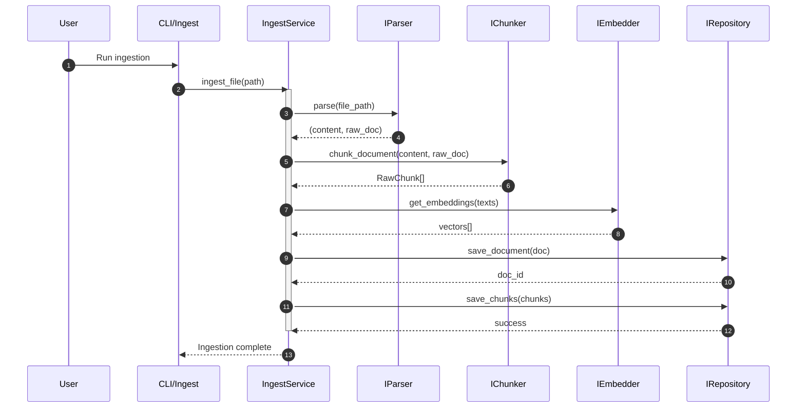

# Target Architecture: Clean RAG with ReAct Agent

This document defines the **Clean Architecture** for the RAG system with a real ReAct agent.

## 1. Design Principles

- **Independence of Frameworks**: Business logic does not depend on external libraries.
- **Testability**: Business rules testable without database or LLM.
- **Independence of UI**: CLI can be replaced with API without affecting core.
- **Independence of Database**: Switch MongoDB to Supabase without touching RAG logic.
- **Independence of Ingestion**: Parsing and chunking strategies swappable via interfaces.

## 2. Layer Structure

### A. Domain Layer (`src/core/`)

Pure data models and abstract contracts:

- **Schemas**: `Document`, `Chunk`, `SearchHit`
- **Interfaces**: `IRepository`, `ILLMProvider`, `IEmbedder`, `IParser`, `IChunker`
- **Exceptions**: Domain-specific errors

### B. Application Layer (`src/services/`)

Business logic orchestration:

| Service | Responsibility |
|---------|----------------|
| `AgentService` | ReAct agent with iterative tool use |
| `RAGService` | Hybrid search and generation |
| `IngestService` | Document processing pipeline |
| `ContextBuilder` | Context assembly with diversity limits |

### C. Infrastructure Layer (`src/infrastructure/`)

Concrete implementations:

| Category | Implementations |
|----------|-----------------|
| Database | `MongoRepository`, `SupabaseRepository` |
| LLM | `OpenAILLMProvider` |
| Embeddings | `OpenAIEmbedder` |
| Ingestion | `DoclingParser`, `DoclingChunker` |

### D. Endpoints Layer (`src/endpoints/`)

User interfaces:

- **CLI**: Rich-based terminal interface
- **API**: (Future) FastAPI endpoints

## 3. Architecture Diagram (C4 Level 2)



## 4. Query Flow (ReAct Agent)



## 5. Ingestion Flow



## 6. Folder Organization

```
src/
├── core/
│   ├── schemas/           # Document, Chunk, SearchHit
│   ├── dtos/              # Data Transfer Objects
│   ├── interfaces/        # Abstract contracts
│   │   ├── repository.py
│   │   ├── llm.py
│   │   ├── embedder.py
│   │   ├── parser.py
│   │   └── chunker.py
│   ├── exceptions.py      # Domain errors
│   └── prompts.py         # System prompts
├── services/
│   ├── agent_service.py   # ReAct Agent
│   ├── rag_service.py     # Hybrid Search + Generation
│   ├── ingest_service.py  # Document Processing
│   └── context_builder.py # Context Assembly
├── infrastructure/
│   ├── database/
│   │   ├── mongo_repository.py
│   │   └── supabase_repository.py
│   ├── llm/
│   │   └── openai_provider.py
│   ├── embeddings/
│   │   └── openai_embedder.py
│   └── ingestion/
│       ├── docling_parser.py
│       └── docling_chunker.py
├── endpoints/
│   └── cli/
│       ├── main.py
│       └── ingest.py
├── bootstrap.py           # Dependency injection
└── settings.py            # Configuration
```

## 7. Related Documentation

| Document | Description |
|----------|-------------|
| [Agent Service](agent-service.md) | ReAct loop implementation details |
| [RAG Service](rag-service.md) | Hybrid search and generation |
| [Context](context.md) | System context (C4 Level 1) |
