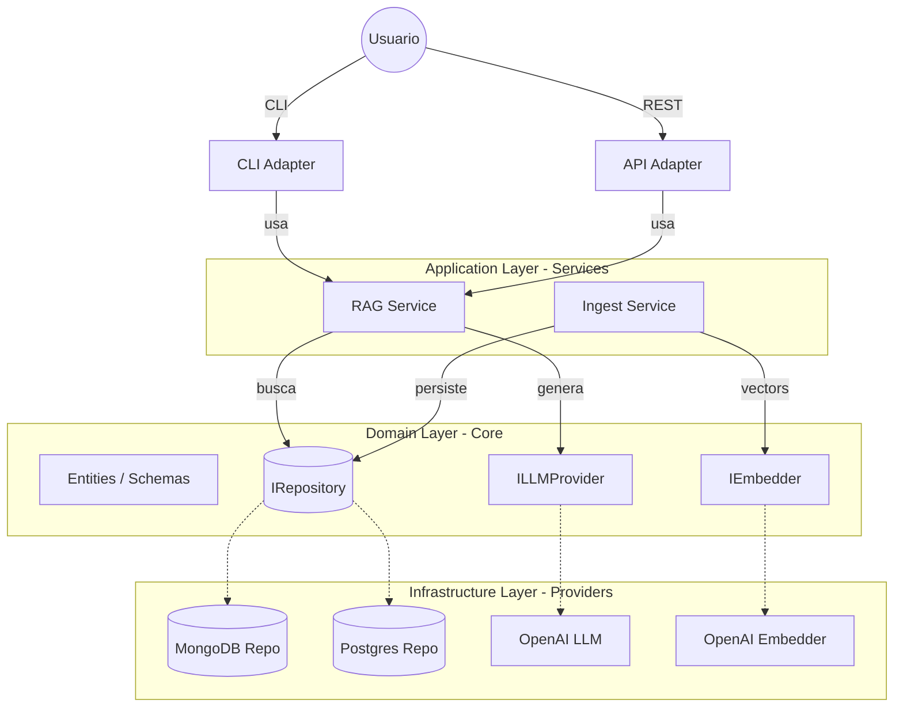

# Arquitectura Objetivo: Clean RAG Architecture

Este documento define la arquitectura **limpia (Clean Architecture)** y desacoplada para el sistema RAG. El objetivo es permitir la intercambiabilidad de proveedores (Base de Datos, LLM, Embeddings) y organizar el código siguiendo principios de responsabilidad única y separación de conceptos.

## 1. Principios de Diseño

- **Independencia de Frameworks**: La lógica de negocio no debe depender de bibliotecas externas.
- **Testabilidad**: Las reglas de negocio se pueden probar sin la base de datos o el LLM.
- **Independencia de la UI**: La interfaz (CLI o API) puede cambiar sin afectar al núcleo.
- **Independencia de la Base de Datos**: Puedes cambiar de MongoDB a PostgreSQL (pgvector) sin tocar la lógica de RAG.

## 2. Estructura de Capas e Interfaces

La arquitectura se organiza en los siguientes contextos:

### A. Schemas (Domain Layer)

Define los modelos de datos base que utiliza todo el sistema. Son puros y no conocen la base de datos.

- `Document`: El documento original.
- `Chunk`: El fragmento con su contenido y metadatos.
- `SearchMatch`: Representa un fragmento recuperado con su score.

### B. DTOs (Data Transfer Objects)

Objetos para mover datos entre capas, especialmente hacia fuera de los _Services_.

- `QueryRequest`: Datos de la consulta del usuario.
- `QueryResponse`: Respuesta formateada con fuentes y metadatos.
- `IngestRequest`: Carga de archivos.

### C. Services (Application Layer)

Contiene la orquestación de la lógica de negocio. Utiliza interfaces (Abstracciones) para interactuar con externos.

- `RAGService`: Orquesta la búsqueda y la generación. Ver [detalle de implementación](file:///home/franblakia/blakia/blakiaxhagalink/Hybrid-RAG-Agent/docs/rag_service_detail.md).
- `IngestionService`: Orquesta la conversión, el chunking y el guardado.

### D. Endpoints (Interface Adapter Layer)

Puntos de entrada al sistema.

- `CLI`: Implementación actual con Rich.
- `API`: (Futuro) Endpoints FastAPI/Flask.

### E. Infrastructure (External Layer)

Implementaciones concretas de las interfaces de proveedores.

- **Database**: `MongoRepository`, `PostgresRepository`.
- **LLM**: `OpenAIProvider`, `AnthropicProvider`.
- **Embedder**: `OpenAIEmbedder`, `LocalEmbedder`.

---

## 3. Diagrama de Arquitectura (Clean Design)



---

## 4. Inversión de Dependencias (Ejemplo de Código)

Para lograr el desacoplamiento, el `RAGService` no importa `pymongo`. En su lugar, usa una interfaz:

```python
# domain/interfaces.py
class IVectorRepository(ABC):
    @abstractmethod
    async def search(self, vector: list[float], limit: int) -> list[Chunk]:
        pass

# services/rag_service.py
class RAGService:
    def __init__(self, repo: IVectorRepository, llm: ILLMProvider):
        self.repo = repo  # Se inyecta la implementación (Mongo o Postgres)
        self.llm = llm

    async def answer(self, query: str):
        # 1. Obtener embedding (vía IEmbedder)
        # 2. resultados = await self.repo.search(vector)
        # 3. respuesta = await self.llm.generate(context, query)
```

## 5. Organización de Carpetas Propuesta

```text
src/
├── core/
│   ├── schemas/        # Document, Chunk, SearchMatch
│   ├── dtos/           # Input/Output Data Transfer Objects
│   └── interfaces/     # Contratos abstractos (BaseDB, BaseLLM)
├── services/           # Lógica de negocio (RAG, Ingest)
├── infrastructure/     # Implementaciones de proveedores
│   ├── database/       # mongo_repo.py, pg_repo.py
│   ├── llm/            # openai_provider.py, anthropic_provider.py
│   └── embeddings/     # openai_embedder.py
└── endpoints/          # CLI e Interfaces de usuario
    ├── cli/            # Actual cli.py adaptado
    └── api/            # (Opcional) FastAPI
```
