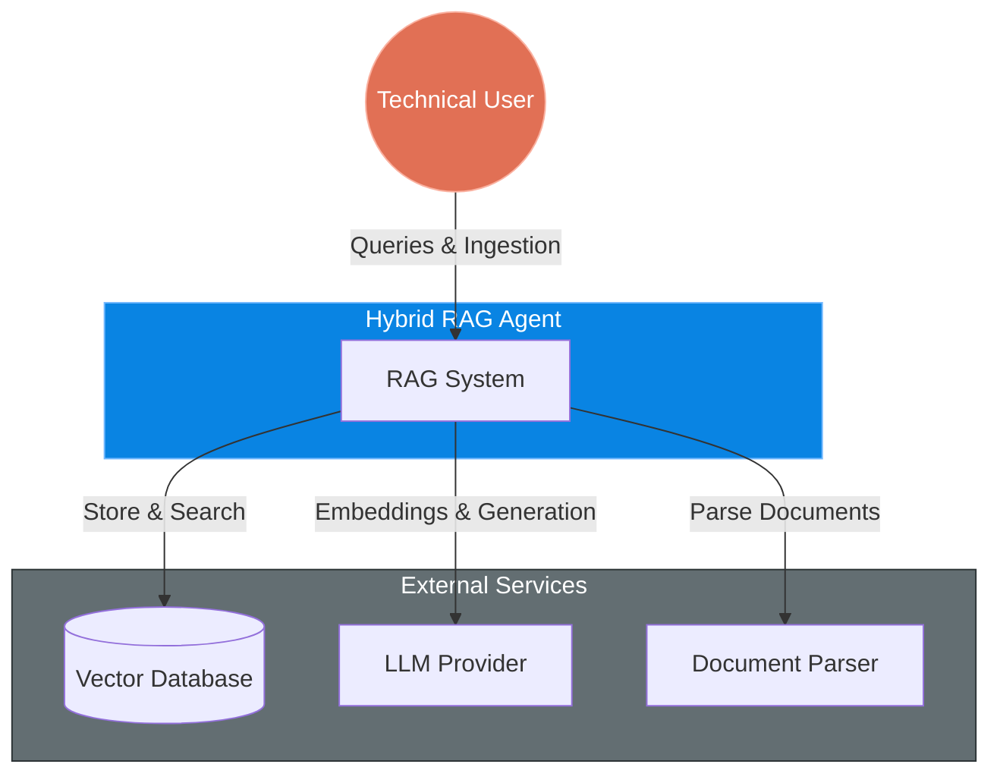
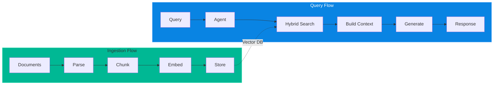

# System Context: Hybrid RAG Agent

This document describes the high-level architecture of the **Hybrid RAG Agent**, a Retrieval-Augmented Generation system designed to search and answer questions over a documentary knowledge base.

## 1. System Context (C4 Level 1)

This diagram is for **business stakeholders** - it shows how the system interacts with users and external services at the highest level.

### Context Description

| Actor/System | Description |
|-------------|-------------|
| **Technical User** | Interacts with the system via CLI to ingest documents and perform queries |
| **Hybrid RAG Agent** | Processes documents, generates embeddings, and answers queries using RAG with hybrid search |
| **Vector Database** | Stores documents, chunks, and performs vector + text searches (MongoDB Atlas or Supabase) |
| **LLM Provider** | Provides embedding generation and text generation (OpenAI, OpenRouter) |
| **Document Parser** | Converts various document formats (PDF, DOCX, etc.) to text (Docling) |

---

## 2. Key Capabilities

### A. Document Ingestion
- Accepts multiple file formats: PDF, DOCX, Markdown, plain text
- Parses documents to extract text content
- Chunks text into semantic fragments
- Generates vector embeddings for each chunk
- Stores chunks with metadata in vector database

### B. Query Processing (RAG)
- Receives natural language queries from users
- Uses a ReAct agent to classify intent and decide on actions
- Performs hybrid search (semantic + keyword) on the knowledge base
- Assembles context from relevant chunks
- Generates responses using LLM with retrieved context

### C. Hybrid Search
- **Semantic Search**: Uses vector embeddings to find conceptually similar content
- **Text Search**: Uses full-text search for exact and fuzzy keyword matches
- **Reciprocal Rank Fusion (RRF)**: Combines results from both search types

---

## 3. Current Implementation

| Component | Implementation |
|-----------|----------------|
| **User Interface** | CLI (Rich library) |
| **Vector Database** | MongoDB Atlas or Supabase (pgvector) |
| **LLM Provider** | OpenAI GPT-4 / OpenRouter |
| **Embedding Model** | OpenAI text-embedding-3-small |
| **Document Parser** | Docling |

---

## 4. Related Documentation

- **[Architecture (C4 Level 2-3)](architecture.md)**: Container and Component diagrams
- **[Agent Service Detail](agent_service_detail.md)**: ReAct agent implementation
- **[RAG Service Detail](rag_service_detail.md)**: Hybrid search and generation flow

---

## 5. Data Flow Overview

