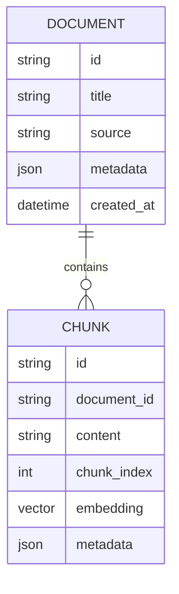

# Database Architecture and Documentation (Hybrid RAG)

This document captures the **actual database design** used by this Hybrid RAG system, aligned to code and migrations. It focuses on the two supported backends:

- **MongoDB Atlas** (vector + text search)
- **Supabase/PostgreSQL + pgvector** (RPC-based semantic and text search)

## 1. Data Model (Shared Conceptual View)

The system stores two logical entities:

- **Document**: source-level metadata and provenance.
- **Chunk**: atomic retrieval unit with content and embeddings.

Relationship: **Document 1..N Chunks**.

## 2. MongoDB (Atlas) Implementation

### Collections

#### `documents`
- `title` (string)
- `source` (string)
- `content` (string)
- `metadata` (object)
- `created_at` (datetime)

#### `chunks`
- `document_id` (ObjectId, ref `documents._id`)
- `content` (string)
- `embedding` (array<float>)
- `chunk_index` (int)
- `metadata` (object)
- `created_at` (datetime)

### Indexes

- **Vector search**: `vector_index` on `chunks.embedding`
- **Text search**: `text_index` on `chunks.content`

These index names are required by `MongoRepository`:
- `semantic_search()` uses `$vectorSearch` with `index: "vector_index"`
- `text_search()` uses `$search` with `index: "text_index"`

### Access Patterns

- Save document -> `documents.insertOne`
- Save chunks -> `chunks.insertMany`
- Semantic search -> `$vectorSearch` + `$lookup` documents
- Text search -> `$search` + `$lookup` documents

## 3. Supabase/PostgreSQL Implementation

### Tables (from `migrations/000_core_schema.sql`)

#### `documents`
| Column | Type | Notes |
|--------|------|-------|
| `id` | UUID | primary key, `gen_random_uuid()` |
| `title` | TEXT | required |
| `source` | TEXT | required |
| `metadata` | JSONB | default `{}` |
| `created_at` | TIMESTAMPTZ | default `now()` |

#### `chunks`
| Column | Type | Notes |
|--------|------|-------|
| `id` | UUID | primary key, `gen_random_uuid()` |
| `document_id` | UUID | FK -> `documents(id)` ON DELETE CASCADE |
| `content` | TEXT | required |
| `chunk_index` | INTEGER | required |
| `embedding` | vector(1536) | pgvector |
| `metadata` | JSONB | default `{}` |

### Indexes and Constraints

- Unique index for upsert: `chunks(document_id, chunk_index)`
  - Defined in `migrations/001_add_chunk_unique_constraint.sql`
- Full-text search GIN index (optional but recommended):
  - `chunks_content_search_idx` in `migrations/20260115_text_search_rpc.sql`

### RPC Functions

#### Semantic search (pgvector)
Defined in `migrations/000_core_schema.sql`:

`match_chunks(query_embedding vector(1536), match_threshold float, match_count int)`

Returns:
- `id`, `document_id`, `content`, `chunk_index`, `metadata`
- `semantic_score` (1 - distance)
- `doc_title`, `doc_source`

#### Text search (full-text)
Current code in `SupabaseRepository` expects:

`text_search_chunks(query_text TEXT, match_count INTEGER DEFAULT 10)`

Returns:
- `id`, `document_id`, `content`, `chunk_index`, `metadata`
- `text_score` (ts_rank)
- `doc_title`, `doc_source`

This signature is defined in `migrations/002_update_text_search_rpc.sql`.

### Compatibility Note (Important)

`migrations/20260115_text_search_rpc.sql` defines a **different signature** and returns `similarity` instead of `text_score`. The runtime code calls the **002 signature**, so the database must have the 002 version active. If you apply the 20260115 migration, reconcile it to the expected signature or update the repository accordingly.

## 4. Access Patterns (RAG-Critical)

The following queries drive storage and indexing decisions:

1. **Semantic search** by embedding (top-k)
2. **Text search** by keyword (top-k)
3. **Hybrid fusion (RRF)** at the service layer
4. **Join chunk -> document** to enrich results with `title` and `source`

## 5. Data Lifecycle

- Ingestion writes:
  - `documents` once per file
  - `chunks` batch insert/upsert
- Re-ingestion uses **upsert** (Supabase) or **insertMany** (Mongo)
- Cleanup is supported by repository `clean_all()`

## 6. Operational Checklist

- Ensure MongoDB Atlas has both `vector_index` and `text_index`
- Ensure Supabase has pgvector enabled and `match_chunks` RPC deployed
- Apply unique index on `chunks(document_id, chunk_index)` to prevent duplicates
- Keep RPC signatures aligned with `SupabaseRepository`

## 7. Diagram (Conceptual)

## 8. References

- `src/infrastructure/database/mongo_repository.py`
- `src/infrastructure/database/supabase_repository.py`
- `migrations/000_core_schema.sql`
- `migrations/001_add_chunk_unique_constraint.sql`
- `migrations/002_update_text_search_rpc.sql`
- `migrations/20260115_text_search_rpc.sql`
