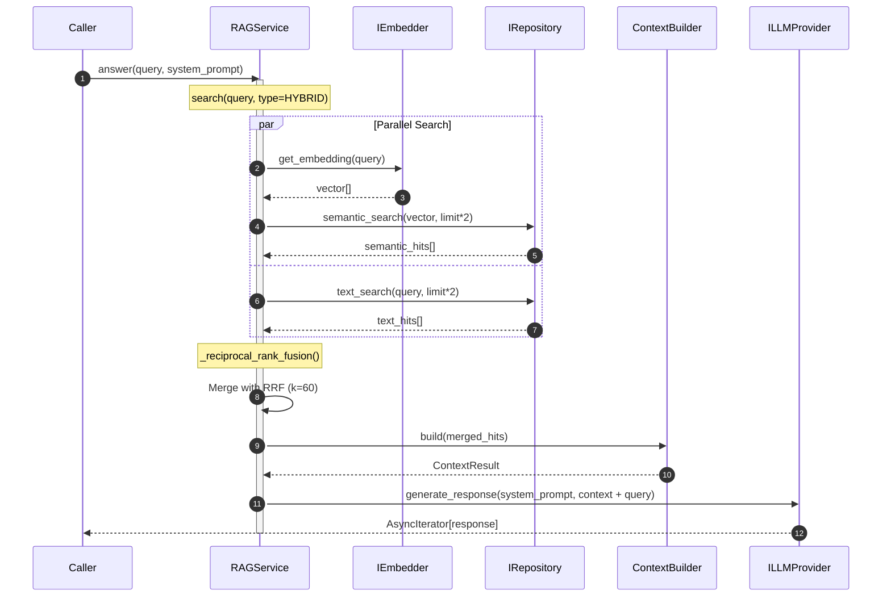
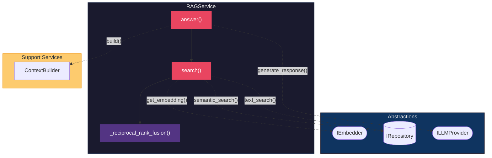

# RAG Service - Hybrid Search and Generation

The `RAGService` orchestrates **Retrieval-Augmented Generation** with hybrid search combining semantic and keyword matching.

## 1. Responsibility

The RAG service handles:

- **Hybrid search**: Semantic + text search with RRF fusion
- **Context building**: Assembles retrieved chunks with diversity limits
- **Response generation**: Streams LLM responses with context

## 2. Sequence Diagram (Hybrid Search Flow)



## 3. Component Diagram



## 4. Search Types

| Mode | Description |
|------|-------------|
| `HYBRID` | Semantic + text search merged with RRF (default) |
| `SEMANTIC` | Vector similarity search only |
| `TEXT` | Full-text keyword search only |

## 5. Reciprocal Rank Fusion (RRF)

Combines results from multiple search channels:

```
score(doc) = SUM( 1 / (k + rank_i(doc)) )
```

Where `k=60` is a smoothing constant that prevents high-ranked documents from dominating.

## 6. Key Methods

| Method | Purpose |
|--------|---------|
| `search()` | Orchestrates search based on type. Returns `(hits, query)`. |
| `answer()` | Full RAG flow: search + context + generation. |
| `_reciprocal_rank_fusion()` | Merges semantic and text results. |

## 7. Dependency Inversion

The service depends only on abstractions:

| Interface | Use |
|-----------|-----|
| `IRepository` | `semantic_search()` and `text_search()` |
| `IEmbedder` | `get_embedding()` for query vectorization |
| `ILLMProvider` | `generate_response()` for answer generation |
| `ContextBuilder` | Assembles context with diversity limits |
