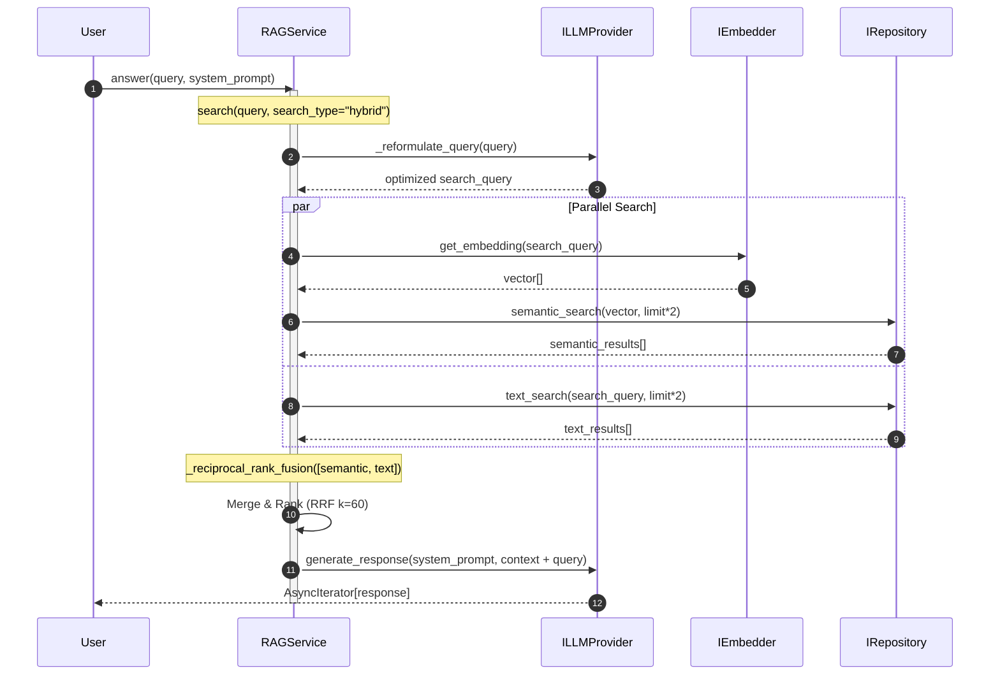
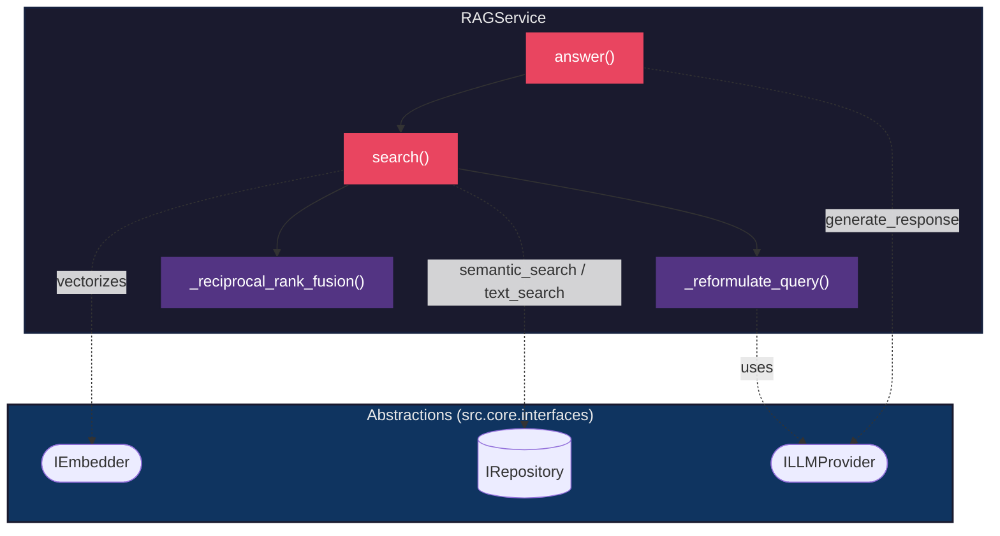

# Implementation Detail: RAG Service

This document provides a "magnifying glass" view of the `RAGService`, detailing its internal logic, data flow, and how it interacts with other system layers.

## 1. Responsibility

The `RAGService` is the main orchestrator of the **Retrieval-Augmented Generation (RAG)** flow. Its function is to mediate between the user query, the knowledge base, and the language model (LLM).

## 2. Sequence Diagram (Hybrid Flow)

The following diagram shows the temporal flow when `search_type="hybrid"` is used:



## 3. Component Diagram (C4 Zoom-in)

Static view of `RAGService` internal dependencies:



## 4. Main Flows

### A. Agentic Hybrid Search (`search_type="hybrid"`)

The `search()` method coordinates multiple steps:

1. **Reformulation**: `_reformulate_query()` uses the LLM to clean conversational noise from the query and extract keywords.
2. **Parallelism**:
    - Generates embeddings via `IEmbedder.get_embedding()`.
    - Executes full-text search via `IRepository.text_search()`.
3. **Rank Fusion (RRF)**: `_reciprocal_rank_fusion()` combines results using the formula:
    ```
    score(d) = Σ 1 / (k + rank_i(d))
    ```
    where `k=60` is the smoothing parameter.

### B. Alternative Modes

| Mode       | Description                                       |
| ---------- | ------------------------------------------------- |
| `semantic` | Vector search only, no reformulation or RRF       |
| `text`     | Text search only (BM25/FTS), no embeddings        |

### C. Response Generation (`answer()`)

1. Invokes `search()` to get top matches.
2. Builds the `context` by concatenating retrieved fragments.
3. Formats the `user_prompt` injecting context + original question.
4. Returns an `AsyncIterator[str]` to support streaming.

## 5. Dependency Inversion

`RAGService` does not know concrete implementations. It depends exclusively on interfaces:

| Interface      | Use                                               |
| -------------- | ------------------------------------------------- |
| `IRepository`  | `semantic_search()` and `text_search()`             |
| `IEmbedder`    | `get_embedding()` to vectorize queries            |
| `ILLMProvider` | `generate_response()` to reformulate and respond  |

---

> [!TIP]
> To adjust ranking logic, modify the `_reciprocal_rank_fusion()` method and its `k` parameter.
