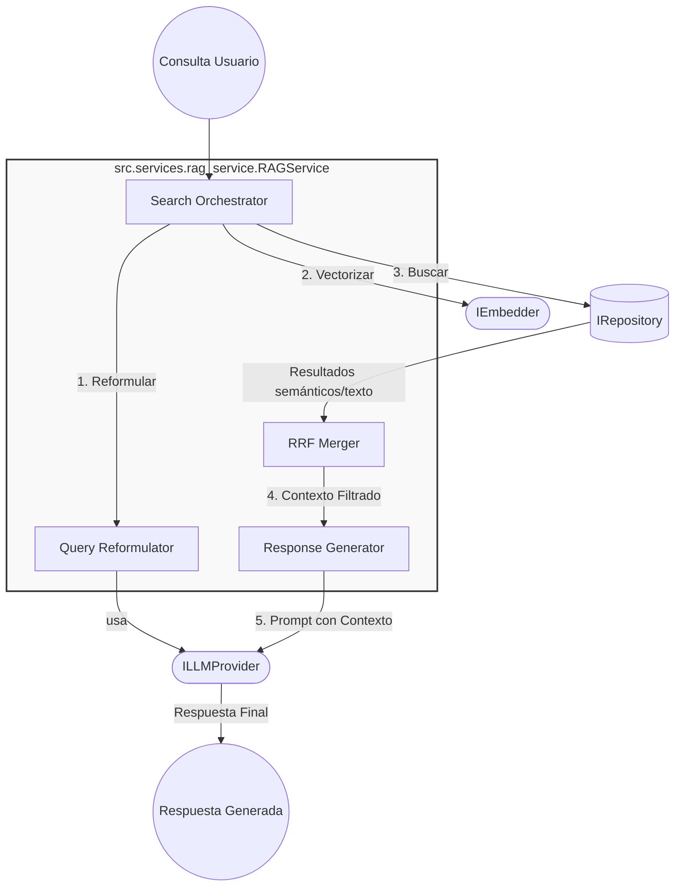

# Detalle de Implementación: RAG Service

Este documento proporciona una vista de "lupa" sobre el `RAGService`, detallando su lógica interna, flujo de datos y cómo interactúa con otras capas del sistema.

## 1. Responsabilidad

El `RAGService` es el orquestador principal del flujo de **Generación Aumentada por Recuperación (RAG)**. Su función es mediar entre la consulta del usuario, la base de conocimientos y el modelo de lenguaje (LLM).

## 2. Diagrama de Componentes (C4 Zoom-in)

## 3. Flujos Principales

### A. Búsqueda Híbrida agentica

El método `search` coordina múltiples pasos cuando se utiliza el modo `hybrid`:

1. **Reformulación**: Utiliza el LLM para limpiar la consulta de ruido conversacional y extraer keywords.
2. **Paralelismo**:
   - Genera embeddings para búsqueda semántica.
   - Ejecuta búsqueda de texto completo (BM25/FTS).
3. **Misión de Rangos (RRF)**: Implementa _Reciprocal Rank Fusion_ para combinar los resultados de ambos métodos sin depender de escalas comunes de score.

### B. Generación de Respuesta

El método `answer` orquesta el cierre del ciclo:

1. Recupera los top matches usando el orquestador de búsqueda.
2. Construye un `context` uniendo los fragmentos recuperados.
3. Formatea el `user_prompt` inyectando el contexto y la pregunta original.
4. Retorna un `AsyncIterator` para soportar streaming en la interfaz.

## 4. Inversión de Dependencias

El `RAGService` no conoce implementaciones concretas. Depende exclusivamente de interfaces definidas en `src.core.interfaces`:

- **IRepository**: Para `semantic_search` y `text_search`.
- **IEmbedder**: Para convertir texto en vectores.
- **ILLMProvider**: Para razonar (reformular) y generar texto.

---

> [!TIP]
> Si deseas cambiar la lógica de ranking, el lugar adecuado es el método `_reciprocal_rank_fusion` dentro de esta clase.
