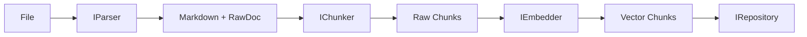

# Document Ingestion (Modular & Decoupled)

This module has been redesigned under **Clean Architecture** principles to allow easy swapping of parsing, chunking, and embedding providers.

## 🏗️ Ingestion Architecture

The ingestion flow is orchestrated by the `IngestService`, which now depends on abstract interfaces instead of concrete implementations:

### 1. Interfaces (Domain Layer)
Located in `src/core/interfaces/`:
- **`IParser`**: Defines how to read a file. Allows switching Docling for LlamaParse, Unstructured.io, or a simple text parser.
- **`IChunker`**: Defines how to split text. Allows using hybrid, sentence-based, or fixed-token strategies.

### 2. Infrastructure Implementations
Located in `src/infrastructure/ingestion/`:
- **`DoclingParser`**: Robust implementation supporting PDF, Word, Excel, Markdown, and Audio transcription via Whisper.
- **`DoclingChunker`**: Uses Docling's `HybridChunker` to maintain hierarchical coherence (headers, tables) and respect embedding model token limits.

## 🚀 How to Extend

### To use a new Parser (e.g., LlamaParse):
1. Create `src/infrastructure/ingestion/llama_parser.py` implementing `IParser`.
2. Update `src/bootstrap.py` to inject `LlamaParser` into the `IngestService`.

### To use a new Chunker:
1. Create your implementation of `IChunker`.
2. Inject it via the bootstrap.

## 📂 Module Files
- `src/services/ingest_service.py`: The "pure" business logic orchestrator.
- `src/infrastructure/ingestion/`: Technology-specific implementations (Docling).
- `src/core/interfaces/`: Contracts ensuring decoupling.

---
*Note: This architecture ensures the business logic remains clean and independent of specific parsing or chunking tools.*
